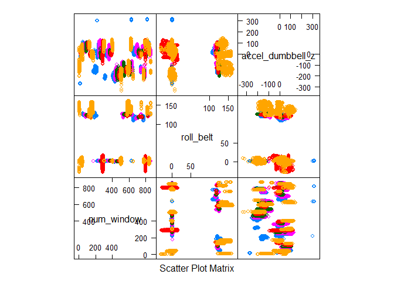

# practical machine learning assignment

# Assignment Objective

The assignment requires to predict the manner in which various subjects did the exercise by identifying true value for classe variable highlighting model building details, cross validation technique and error measure. 


# Solution Approach

The solution approach consists of following steps:

Loading train and test data
Data Cleaning and data preparation for exploratory data analysis
Training and Validation data creation
Exploratory data analysis
Model building and cross validation
Model Testing and model finalization
Predicting Outcome on test data

### Loading train and test data : 
Load train and test data csv files in R

### Data Cleaning and data preparation for exploratory data analysis: 
As final prediction is required for test data which
has 20 rows, test data should have sufficient values for independent variables and hence, only those features have been considered which has less than 20% of missing values.

### Training and Validation data creation: 
Training and Validation data set has been created with 80:20 ratio

### Exploratory data analysis: 
Box plot of dependent variable has been plotted with respect to various independent features
and some fo the key features have been plotted. Also, distribution of unique value for dependent variable is checked for
understanding of distribution.

### Model building and cross validation:
CART based decision tree has been used to build the classification model with
3 fold repeat cross validation method on training dataset. The output of decision tree and significant features have been plotted for better understanding of classification drivers.

### Model Testing and model finalization:
Out of sample error and model accuracy has been tested on validation dataset. Once an acceptable model accuracy is reached, the model is finalized.


### Predicting Outcome on test data:
The final model is selected and used to predict classe for test data set using selected classification model


```r
library(ISLR)
library(caret)
```

```
## Loading required package: lattice
```

```
## Loading required package: ggplot2
```

```r
library(tree)
library(caret)
library(party)
```

```
## Loading required package: grid
```

```
## Loading required package: mvtnorm
```

```
## Loading required package: modeltools
```

```
## Loading required package: stats4
```

```
## Loading required package: strucchange
```

```
## Loading required package: zoo
```

```
## 
## Attaching package: 'zoo'
```

```
## The following objects are masked from 'package:base':
## 
##     as.Date, as.Date.numeric
```

```
## Loading required package: sandwich
```

```r
library(partykit)
```

```
## 
## Attaching package: 'partykit'
```

```
## The following objects are masked from 'package:party':
## 
##     cforest, ctree, ctree_control, edge_simple, mob, mob_control,
##     node_barplot, node_bivplot, node_boxplot, node_inner,
##     node_surv, node_terminal
```

```r
library(rpart)
library(rpart.plot)
library(rattle)
```

```
## Rattle: A free graphical interface for data mining with R.
## Version 4.1.0 Copyright (c) 2006-2015 Togaware Pty Ltd.
## Type 'rattle()' to shake, rattle, and roll your data.
```

```r
library(readr)
library(xgboost)
library(RANN)
library(Metrics)
library(DiagrammeR)
library(readr)
library(dplyr)
```

```
## 
## Attaching package: 'dplyr'
```

```
## The following object is masked from 'package:xgboost':
## 
##     slice
```

```
## The following objects are masked from 'package:stats':
## 
##     filter, lag
```

```
## The following objects are masked from 'package:base':
## 
##     intersect, setdiff, setequal, union
```

```r
library(nnet)
library(data.table)
```

```
## 
## Attaching package: 'data.table'
```

```
## The following objects are masked from 'package:dplyr':
## 
##     between, last
```

```r
library(knitr)
library(rmarkdown)

train<-read.csv("pml-training.csv")
test<-read.csv("pml-testing.csv")
str(train[,150:160])
```

```
## 'data.frame':	19622 obs. of  11 variables:
##  $ var_yaw_forearm : num  NA NA NA NA NA NA NA NA NA NA ...
##  $ gyros_forearm_x : num  0.03 0.02 0.03 0.02 0.02 0.02 0.02 0.02 0.03 0.02 ...
##  $ gyros_forearm_y : num  0 0 -0.02 -0.02 0 -0.02 0 -0.02 0 0 ...
##  $ gyros_forearm_z : num  -0.02 -0.02 0 0 -0.02 -0.03 -0.02 0 -0.02 -0.02 ...
##  $ accel_forearm_x : int  192 192 196 189 189 193 195 193 193 190 ...
##  $ accel_forearm_y : int  203 203 204 206 206 203 205 205 204 205 ...
##  $ accel_forearm_z : int  -215 -216 -213 -214 -214 -215 -215 -213 -214 -215 ...
##  $ magnet_forearm_x: int  -17 -18 -18 -16 -17 -9 -18 -9 -16 -22 ...
##  $ magnet_forearm_y: num  654 661 658 658 655 660 659 660 653 656 ...
##  $ magnet_forearm_z: num  476 473 469 469 473 478 470 474 476 473 ...
##  $ classe          : Factor w/ 5 levels "A","B","C","D",..: 1 1 1 1 1 1 1 1 1 1 ...
```

```r
################        Data Cleaning starts       ##########################


# Identify columns with missing value from test data set
na_count <-sapply(test, function(y) sum(length(which(is.na(y)))))
na_count <- data.frame(na_count)
na_count<-cbind(colnames(test),na_count)
head(na_count)
```

```
##                            colnames(test) na_count
## X                                       X        0
## user_name                       user_name        0
## raw_timestamp_part_1 raw_timestamp_part_1        0
## raw_timestamp_part_2 raw_timestamp_part_2        0
## cvtd_timestamp             cvtd_timestamp        0
## new_window                     new_window        0
```

```r
colnames(na_count)<-c("feature","count_na")

percent_missing<-.2
limit_missing<-.2*nrow(test)
useful_features<-subset(na_count,count_na<limit_missing)
nrow(useful_features)
```

```
## [1] 60
```

```r
useful_features<-as.vector(useful_features[c(1:nrow(useful_features)),1])
useful_features
```

```
##  [1] "X"                    "user_name"            "raw_timestamp_part_1"
##  [4] "raw_timestamp_part_2" "cvtd_timestamp"       "new_window"          
##  [7] "num_window"           "roll_belt"            "pitch_belt"          
## [10] "yaw_belt"             "total_accel_belt"     "gyros_belt_x"        
## [13] "gyros_belt_y"         "gyros_belt_z"         "accel_belt_x"        
## [16] "accel_belt_y"         "accel_belt_z"         "magnet_belt_x"       
## [19] "magnet_belt_y"        "magnet_belt_z"        "roll_arm"            
## [22] "pitch_arm"            "yaw_arm"              "total_accel_arm"     
## [25] "gyros_arm_x"          "gyros_arm_y"          "gyros_arm_z"         
## [28] "accel_arm_x"          "accel_arm_y"          "accel_arm_z"         
## [31] "magnet_arm_x"         "magnet_arm_y"         "magnet_arm_z"        
## [34] "roll_dumbbell"        "pitch_dumbbell"       "yaw_dumbbell"        
## [37] "total_accel_dumbbell" "gyros_dumbbell_x"     "gyros_dumbbell_y"    
## [40] "gyros_dumbbell_z"     "accel_dumbbell_x"     "accel_dumbbell_y"    
## [43] "accel_dumbbell_z"     "magnet_dumbbell_x"    "magnet_dumbbell_y"   
## [46] "magnet_dumbbell_z"    "roll_forearm"         "pitch_forearm"       
## [49] "yaw_forearm"          "total_accel_forearm"  "gyros_forearm_x"     
## [52] "gyros_forearm_y"      "gyros_forearm_z"      "accel_forearm_x"     
## [55] "accel_forearm_y"      "accel_forearm_z"      "magnet_forearm_x"    
## [58] "magnet_forearm_y"     "magnet_forearm_z"     "problem_id"
```

```r
useful_features<-useful_features[1:length(useful_features)-1]

# Remove columns with missing value
train1<-cbind(train[,useful_features],train$classe)
dim(train1)
```

```
## [1] 19622    60
```

```r
colnames(train1)[60]<-"classe"
train1$classe<-as.factor(train1$classe)

#########################        Data Cleaning Ends        ############################


########################      Train & Test data preparation starts      #######################
set.seed(123)
intrain<-createDataPartition(y=train1$classe,p=0.8,list = FALSE)
training<-train1[intrain,]
testing<-train1[-intrain,]

########################      Train & Test data preparation ends      #######################


#######################     Exploratory data analysis begins          ########################
table(training$classe)
```

```
## 
##    A    B    C    D    E 
## 4464 3038 2738 2573 2886
```

```r
featurePlot(x=training[,c("num_window","roll_belt","accel_dumbbell_z")],y=training$classe,plot = "pairs")
```



```r
par(mfrow=c(2,2), mar=c(2,5,2,1), las=1, bty="n")
boxplot(num_window~classe,data=training, main="classes num window data",xlab="classe", ylab="num_window")
boxplot(roll_belt~classe,data=training, main="classes roll_belt data",xlab="classe", ylab="roll_belt")
boxplot(magnet_dumbbell_x~classe,data=training, main="classes magnet_dumbbell_x data",xlab="classe", ylab="magnet_dumbbell_x")
boxplot(pitch_forearm~classe,data=training, main="classes pitch_forearm data",xlab="classe", ylab="pitch_forearm")
```


```r
boxplot(accel_dumbbell_z~classe,data=training, main="classes accel_dumbbell_z data",xlab="classe", ylab="accel_dumbbell_z")


#######################     Exploratory data analysis ends          ########################

######################     Model training and Cross Validation starts    ##########################
training1<-training[,-c(1:2)]
testing1<-testing[,-c(1:2)]

cvCtrl <- trainControl(method = "repeatedcv", repeats = 3)
modfit<-train(classe ~.,method="rpart",data=training1,tuneLength = 50,trControl = cvCtrl)
plot(varImp(modfit), top = 20)

######################     Model training and Cross Validation ends    ##########################


######################     Classification and out of sample error calculation starts    ##########################
tree.pred.modfit = predict(modfit, testing1)
cmatrix.modfit<-table(tree.pred.modfit, testing1$classe)
output.modfit<-confusionMatrix(cmatrix.modfit)
output.modfit
```

```
## Confusion Matrix and Statistics
## 
##                 
## tree.pred.modfit    A    B    C    D    E
##                A 1114   10    1    0    1
##                B    0  747    2    0    0
##                C    0    2  674    1    1
##                D    0    0    3  637    3
##                E    2    0    4    5  716
## 
## Overall Statistics
##                                           
##                Accuracy : 0.9911          
##                  95% CI : (0.9876, 0.9938)
##     No Information Rate : 0.2845          
##     P-Value [Acc > NIR] : < 2.2e-16       
##                                           
##                   Kappa : 0.9887          
##  Mcnemar's Test P-Value : NA              
## 
## Statistics by Class:
## 
##                      Class: A Class: B Class: C Class: D Class: E
## Sensitivity            0.9982   0.9842   0.9854   0.9907   0.9931
## Specificity            0.9957   0.9994   0.9988   0.9982   0.9966
## Pos Pred Value         0.9893   0.9973   0.9941   0.9907   0.9849
## Neg Pred Value         0.9993   0.9962   0.9969   0.9982   0.9984
## Prevalence             0.2845   0.1935   0.1744   0.1639   0.1838
## Detection Rate         0.2840   0.1904   0.1718   0.1624   0.1825
## Detection Prevalence   0.2870   0.1909   0.1728   0.1639   0.1853
## Balanced Accuracy      0.9970   0.9918   0.9921   0.9944   0.9948
```

```r
######################     Classification and out of sample error calculation ends    ##########################


###################### final model building on overall train data   starts       ########################
train2<-train1[,-c(1:2)]

cvCtrl_final <- trainControl(method = "repeatedcv", repeats = 3)
modfit_final<-train(classe ~.,method="rpart",data=train2,tuneLength = 50,trControl = cvCtrl_final)

plot(varImp(modfit_final), top = 20)

###################### final model building on overall train data   ends       ########################


######################  Classification for given test data starts         ##########################

tree.pred.modfit = predict(modfit_final, test)
tree.pred.modfit
```

```
##  [1] B A B A A E D B A A B C B A E E A B B B
## Levels: A B C D E
```

```r
######################  Classification for given test data ends         ##########################
```


